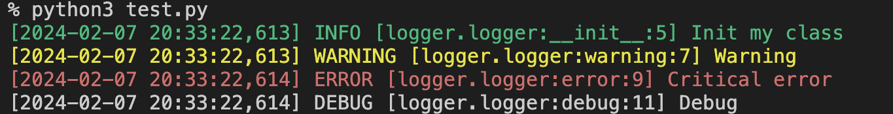

# Logger Package
[](https://github.com/obervinov/logger-package/actions/workflows/release.yaml)
[](https://github.com/obervinov/logger-package/actions/workflows/github-code-scanning/codeql)
[](https://github.com/obervinov/logger-package/actions/workflows/pr.yaml)


##  About this project
This is an additional implementation over the **logging** module.

This module is designed for fast initialization and configuration of readable and structured logging.

##  GitHub Actions
| Name  | Version |
| ------------------------ | ----------- |
| GitHub Actions Templates | [v1.0.13](https://github.com/obervinov/_templates/tree/v1.0.13) |


##  Supported functions
- Color selection depending on the logging level
- Structured and formatted message for more informative
- Loading the logger configuration and format from a environment variables

##  Installing with Poetry
```bash
tee -a pyproject.toml <<EOF
[tool.poetry]
name = myproject"
version = "1.0.0"

[tool.poetry.dependencies]
python = "^3.10"
logger = { git = "https://github.com/obervinov/logger-package.git", tag = "v1.0.6" }

[build-system]
requires = ["poetry-core"]
build-backend = "poetry.core.masonry.api"
EOF

poetry install
```

##  Usage example
### Environment variables
| Name  | Description | Default value |
| ------------------------ | ------------------------------------------------ | --------------------------------------------------------------------- |
| `LOGGER_FORMAT` | A string with the event logging format | `[%(asctime)s] %(levelname)s [%(name)s.%(funcName)s:%(lineno)d] %(message)s` |
| `LOGGER_LEVEL` | Event logging level: DEBUG, INFO, WARNING, ERROR, CRITICAL or NOT SET | `INFO` |
| `LOGGER_DATE_FORMAT` | Date format in logging event output | `%d/%b/%Y %H:%M:%S` |

### Examples
#### Simple
```python
# Import module
from logger import log

# Examples
# error message
log.error(f"this error: {error}")

# warning message
log.warning(f"this warning: {warn}")

# info message
log.info(f"this info: {info}")
```

#### With using class
```python
from logger import log

class myproject:
  def __init__(self):
    self.log = create_logger(__name__, self.__class__.__name__)
    self.log.info("Init my class")

  def warning(self):
    self.log.warning("Warning")

  def error(self):
    self.log.error("Critical error")

  def debug(self):
    self.log.debug("Debug")

mp = myproject()
mp.warning()
mp.error()
mp.debug()
```
